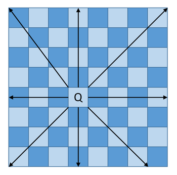

# 8Queen(8王妃問題)

参考サイト : https://engineeringnote.hateblo.jp/entry/python/algorithm-and-data-structures/8queens


本記事は、ソフトバンクパブリッシングから発行されている「定本 Cプログラマのためのアルゴリズムとデータ構造 (SOFTBANK BOOKS)」を参考にPythonでアルゴリズムとデータ構造について学習していきます。

今回は、バックトラック法による8クイーン（Eight Queens Puzzle）について学んでいきます。

## 8クイーン問題とは

8クイーン（Eight Queens Puzzle：エイト・クイーン）とは、チェス盤と駒のクイーンを使ったパズルのことを言います。

クイーンは、将棋でいう飛車と角を合わせた動きが可能で、以下のように移動することができます。



そして、どのように8つのクイーンを互いに利いていない場所に配置していくかを考えるのが、今回の8クイーン問題になります。

1848年にMax Bezzelが発表し、数学者のC.F.Gauss（有名なガウスです）などもこの問題に挑戦しましたが、数学的な解法は見つかっておらず、一つ一つ盤上の駒と駒の関係を確かめながら解いていくしかないようです。 

### Pythonで8クイーンを作成

それでは、Pythonで8クイーン問題を解くスクリプトを作成します。

今回では、解が一つ見つかったら終了になります。


```python
# 8queens.py
SUCCESS = 1
FAIL = 0

FREE = 1
NOT_FREE = 0
N = 8

class Queens:
    def __init__(self):
        self.pos = [-1 for _ in range(N)]
        self.col = [FREE for _ in range(N)]
        self.up = [FREE for _ in range(2*N-1)]
        self.down = [FREE for _ in range(2*N-1)]

    def print_queens(self):
        for i in range(N):
            for j in range(N):
                if self.pos[i] == j:
                    print("Q ", end="")
                else:
                    print(". ", end="")
            print()

    def put_queen(self, a):
        for b in range(N):
            if self.col[b] == FREE and self.up[a+b] == FREE and \
                self.down[a-b+(N-1)] == FREE:
                self.pos[a] = b
                self.col[b] = NOT_FREE
                self.up[a+b] = NOT_FREE
                self.down[a-b+(N-1)] = NOT_FREE

                if a + 1 >= N:
                    return SUCCESS
                else:
                    if self.put_queen(a+1) == SUCCESS:
                        return SUCCESS
                    else:
                        self.pos[a] = -1
                        self.col[b] = FREE
                        self.up[a+b] = FREE
                        self.down[a-b+(N-1)] = FREE

        return FAIL

    def run(self):
        if self.put_queen(0) == SUCCESS:
            self.print_queens()
        else:
            print("Sorry, but there is no solution.")

if __name__ == '__main__':
    q = Queens()
    q.run()
```

### 動作確認

それでは上記で作成したスクリプトを実行してみます。

```shell
 $ python 8queens.py
 Q . . . . . . .
 . . . . Q . . .
 . . . . . . . Q
 . . . . . Q . .
 . . Q . . . . .
 . . . . . . Q .
 . Q . . . . . .
 . . . Q . . . .
```


